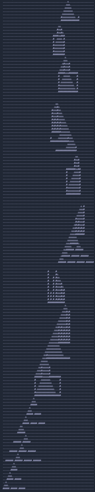

# Advent of Code 2022

> Language: TypeScript

## How to run

`npm start <day>`

e.g. `npm start 1`, `npm start 2`

### Performance

I'm really not trying to optimise for performance in these solutions. As long as they dont take more than a few minutes to run, then I'm happy. Below is the approx time it takes for each solution to run on my 2022 MacBook Pro M1 Pro.

| Day | Part 1      | Part 2                       |
| --- | ----------- | ---------------------------- |
| 1   | `0.4ms`     | `0.3ms`                      |
| 2   | `1.4ms`     | `1.1ms`                      |
| 3   | `0.5ms`     | `0.2ms`                      |
| 4   | `1.1ms`     | `1.0ms`                      |
| 5   | `1.0ms`     | `0.3ms`                      |
| 6   | `0.1ms`     | `0.2ms`                      |
| 7   | `2.2ms`     | `1.4ms`                      |
| 8   | `6.2ms`     | `1.9ms`                      |
| 9   | `5.4ms`     | `7.2ms`                      |
| 10  | `0.3ms`     | `0.2ms`                      |
| 11  | `0.7ms`     | `58.9ms`                     |
| 12  | `193.9ms`   | `150.8ms`                    |
| 13  | `0.9ms`     | `3.1ms`                      |
| 14  | `12.0ms`    | `404.5ms`                    |
| 15  | `582.6ms`   | `2,463.0ms`                  |
| 16  | `392.5ms`   | `53,612.7ms` (yikes)         |
| 17  | `109.5ms`   | `114.7ms`                    |
| 18  | `5.6ms`     | `36.0ms`                     |
| 19  | `5,277.7ms` | `114,737.9ms` (double yikes) |

## Tests

`npm test`

## Images

> Some visualisations of my puzzle inputs :)

### Day 12 - Part 1

### Day 14 - Part 1

### Day 14 - Part 2

