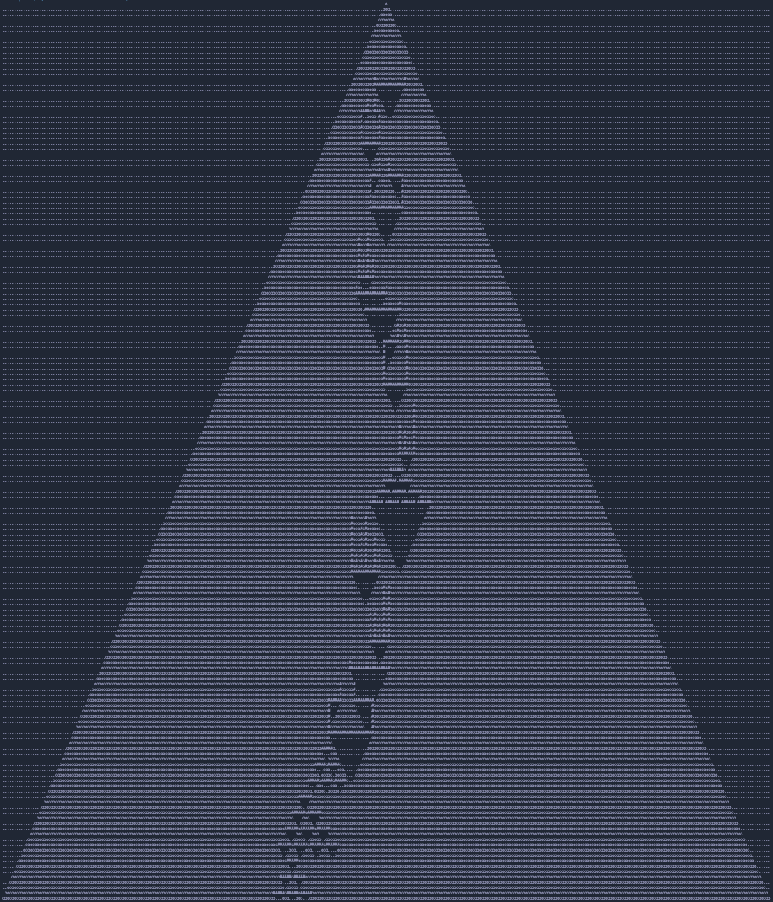

# Advent of Code 2022

> Language: TypeScript

## How to run

`npm start <day>`

e.g. `npm start 1`, `npm start 2`

## Tests

`npm test`

## Images

> Some visualisations of my puzzle inputs :)

### Day 12 - Part 1

### Day 14 - Part 1

### Day 14 - Part 2

